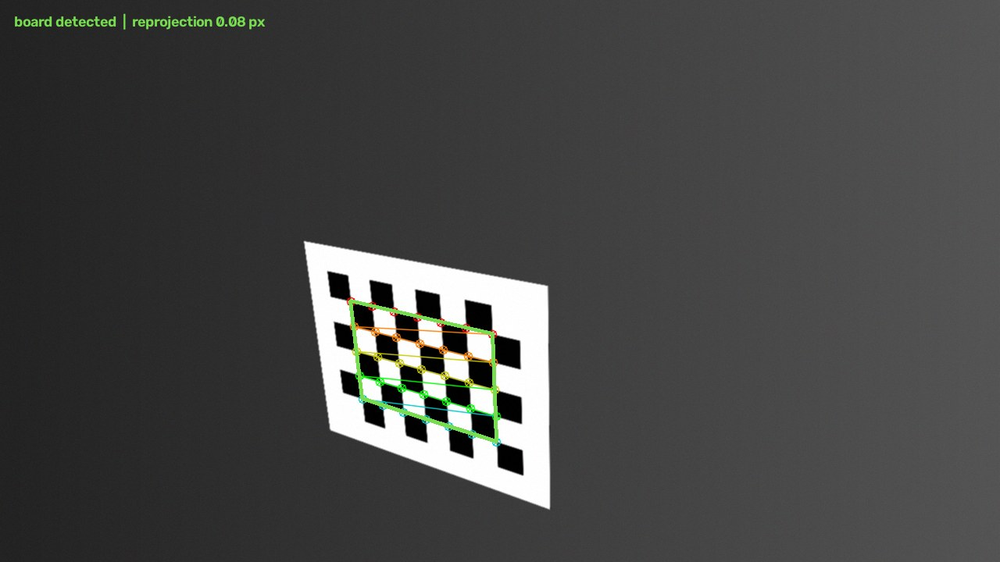

# Calibration Studio — camera × LiDAR extrinsic calibration

A web UI and solver for finding the rigid transform between a camera and a LiDAR.
Point it at your sensors, hold a checkerboard in front of them, and it tells you
where they are relative to each other — with live feedback on whether the poses
you are collecting can actually determine the answer.

Calibration maths is well understood. Calibration *tooling* is not: it is
usually a CLI, a folder of files you must name correctly, and a YAML file whose
fields are documented in a source comment. This project keeps the validated
maths and fixes the part that wastes your afternoon.



**Status:** camera–LiDAR extrinsics work end to end and are numerically
validated (see [Accuracy](#accuracy)). Other sensor types are not implemented.

---

## Try it in two minutes, with no hardware

The tool ships with a **simulated rig**: a virtual camera and LiDAR observing a
checkerboard, with a ground-truth extrinsic baked in. The entire live workflow
runs against it, so you can see what the tool does before wiring anything up —
and check how close the solver gets to an answer that is known exactly.

```bash
# 1. build the solver (see Requirements below for the C++ dependencies)
cmake -S . -B build && cmake --build build -j$(nproc)

# 2. set up the Python environment
python3 -m venv ui/.venv
ui/.venv/bin/pip install -r ui/requirements.txt

# 3. start the app
ui/.venv/bin/python -m uvicorn ui.app:app --port 8000
```

Open <http://localhost:8000>, pick **Simulated camera** and **Simulated LiDAR**
(they are preselected, and the board and ROI fields are already filled in
correctly), press **Start streaming**, then capture poses as the board moves.

Prefer the terminal? The same thing runs headless as a self-test that compares
the result against ground truth and exits non-zero if it drifts:

```bash
ui/.venv/bin/python tools/validate_live_pipeline.py --poses 12
```

```
  rotation error    : 0.0300 deg
  translation error : 4.44 mm
  solver mean residual: 0.80 mm (max 1.86 mm)
  PASS
```

---

## What "works with any LiDAR" means

Universality lives at the **point-cloud level**, not the driver level.

Every LiDAR ultimately produces the same thing — an array of XYZ points. What
differs is the transport: Livox speaks SDK2 over UDP, Ouster speaks TCP plus a
JSON descriptor, Velodyne emits raw UDP packets that need a calibration XML,
and Hesai and RoboSense each have their own. Writing an adapter per vendor is a
treadmill.

The escape hatch is that **every vendor ships a ROS 2 driver publishing
`sensor_msgs/PointCloud2`**. So one adapter covers the entire market, including
sensors released after this was written. `PointCloud2` is self-describing: a
field table states each field's name, byte offset and numeric type, so the
decoder reads the layout rather than assuming one. That matters — the layouts
really are all different:

| Sensor | Record layout |
|---|---|
| Velodyne VLP-16 | `x,y,z` f32, `intensity` f32, `ring` u16, `time` f32 |
| Ouster OS-1 | `x,y,z` f32, `intensity` f32, `t` u32, `reflectivity` u16, … |
| Livox Mid-360 | `x,y,z` f32, `t` u32, `intensity` f32, `tag` u8, `line` u8 — 22 bytes, unpadded |
| Hesai | `x,y,z` f32, `intensity` f32, `timestamp` f64, `ring` u16 |

### Supported inputs

| Backend | Covers | Needs ROS? |
|---|---|---|
| **ROS 2 topics** | any LiDAR or camera with a ROS driver (`PointCloud2`, `Image`, `CompressedImage`) | yes, at runtime |
| **rosbag2 replay** | recorded sessions, replayed on the bag's own clock | no — pure-Python reader |
| **OpenCV capture** | USB/V4L2 webcams, RTSP/IP cameras, video files | no |
| **Simulated rig** | no hardware at all; ground truth known | no |

### Plugging in sensors: USB vs Ethernet

These behave differently, and the difference is not arbitrary.

**A USB camera appears by itself.** Plug it in and it is in the dropdown
immediately, because the kernel implements UVC — a standard every webcam speaks —
and exposes it as `/dev/video0`. Select it and the preview starts.

**An Ethernet LiDAR does not,** and cannot. Ethernet is a cable, not a data
standard. The sensor simply emits proprietary UDP at your NIC; nothing in the
operating system knows a sensor exists, and there is no `/dev/*` entry to
enumerate. Something has to speak the vendor's protocol first, and that is the
vendor's ROS driver:

```
Mid-360 ──Ethernet──▶ livox_ros_driver2 ──▶ /livox/points ──▶ appears in the dropdown
```

Start the driver and the topic shows up in the LiDAR list like any other source.

To make that failure legible rather than mysterious, the setup card has a
**"LiDAR not listed? Scan the network"** button. It reports what is actually on
the wire — cable link state, whether your host holds an address on the sensor's
subnet, and whether UDP is arriving on a known LiDAR port — then gives you the
exact command to fix it:

```
[found] Livox LiDAR streaming on UDP 56300
        471 packets from 192.168.1.164 in 1.5s, and nothing is consuming them.
        -> ros2 launch livox_ros_driver2 msg_MID360_launch.py
```

The scan binds those ports **exclusively**, so it can never steal packets from a
driver that is already running — if the port is held, it says so and touches
nothing.

### One thing that is genuinely not universal

**Scan pattern.** A spinning LiDAR delivers a full sweep per revolution, so one
message is a usable frame. A non-repetitive scanner like the Livox Mid-360
paints a sparse pattern that only fills in over time — a single message is far
too thin to fit a board plane to.

So the accumulation window is an explicit setting rather than something hidden:

- **Spinning** (Velodyne, Ouster, Hesai, RoboSense) → `0` s, lowest latency.
- **Non-repetitive** (Livox) → `1`–`2` s. On a Mid-360 this takes a 24 000-point
  message up to roughly 360 000 points, which is what makes the board segmentable.

---

## The workflow

### Live capture

```
  choose sources ──▶ stream + detect ──▶ capture poses ──▶ solve ──▶ export
   camera + lidar     live feedback      guided by         Ceres     YAML,
   auto-discovered    on both sensors    quality meters              both conventions
```

**1 — Sources & board.** The app scans for ROS topics, V4L2 cameras and rosbag
recordings, and lists what it finds. Enter your checkerboard geometry as
**internal corner counts, not squares** (an 8×6-square board has 7×5 internal
corners — getting this wrong is the single most common reason detection never
fires, so the form says so at the point of entry). Set the LiDAR ROI to a box
around where you will hold the board.

If the camera publishes a `camera_info` topic, intrinsics are taken from it
automatically — preferred over `config/camera.yaml`, because a topic is
guaranteed to describe the stream you are actually capturing, whereas a file can
silently belong to a different camera or resolution.

**2 — Capture.** You get a live camera view with detected corners drawn on it,
and a live 3D view of the cloud showing the ROI box and exactly which points
RANSAC latched onto — which is the fastest way to see *why* a detection failed.
Press **Capture pose** (or the space bar) when both sensors see the board.

Capture runs detection twice, a moment apart, and **refuses the pose if the board
moved in between**. This is a correctness gate, not fussiness: the camera frame
and the LiDAR frame are grabbed independently, so a board still in motion can be
in two different places in the two sensors. The solver cannot detect that — it
will fit a rigid transform to the inconsistent pair and return a confident,
wrong answer. In testing, a few such pairs moved the recovered translation by
~200 mm and flipped two of its signs while the residuals still looked fine. So
hold the board still for a beat before capturing.

Three meters track whether the set you are collecting can actually determine the
answer:

- **Poses** — 9 or more gives least-squares enough redundancy to average out noise.
- **Orientation span** — explained below; this is the one that matters most.
- **Image coverage** — how much of the frame the board has visited. Distortion is
  worst at the edges, so centre-only poses leave the corners unmodelled.

**3 — Solve.** The captured poses are written as a `poses.csv` and handed to the
same C++ Ceres solver the offline path uses, so the two can never drift apart.
Results appear as both transform conventions plus a per-pose residual chart, and
the session is saved under `data/live/<name>/` so it can be re-solved later.

### Offline dataset

Already have plane observations? Switch to **Dataset** mode, drop in a
`poses.csv`, inspect the poses in 3D, and solve. The "after calibration" toggle
transforms the LiDAR planes into the camera frame — when the calibration is
good, the orange boards land on the cyan ones.

---

## Why the tool nags you to rotate the board

This is the part most calibration tools leave you to discover the hard way.

The solve is driven by two residuals: normals must agree
(`R·n_lidar ≈ n_camera`), and each LiDAR board point must land on the camera's
board plane (`n_cam·(R·p_lid + t) = d_cam`).

Look at what that second one can see. A board plane only constrains the
component of translation **along its own normal**. Slide the sensor pair
*parallel* to the board and every point-on-plane residual is completely
unchanged. So a single board orientation leaves two translation directions
unobservable — and a hundred frames of the board held at the same angle leave
them exactly as unobservable. More data does not help; different data does.

Recovering all three translation components therefore requires board normals
that **span 3D**. The tool measures this directly as the ratio of the smallest
to largest singular value of the stacked normals, reported as **orientation
span**: near 0 means near-parallel boards and an ill-conditioned solve, higher
means the normals cover all three axes.

Below 0.15 the app refuses to solve and tells you to tilt the board, because the
alternative is a confident-looking answer with meaningless translation. Residuals
will not warn you — a degenerate set can fit beautifully and still be wrong.

Practically: tilt the board left, right, up and down; vary its distance; and work
it into the frame corners as well as the centre.

---

## Requirements

**Solver (C++17):** OpenCV, PCL 1.12, Eigen3 ≥ 3.3, Ceres, yaml-cpp.

```bash
# Ubuntu / Debian
sudo apt install libopencv-dev libpcl-dev libeigen3-dev libceres-dev libyaml-cpp-dev cmake build-essential
```

**UI:** Python ≥ 3.9. `ui/requirements.txt` installs into a plain virtualenv on
any OS; ROS is not among the dependencies.

**For live ROS sources**, source your ROS setup before starting the server:

```bash
source /opt/ros/humble/setup.bash
ui/.venv/bin/python -m uvicorn ui.app:app --port 8000
```

That is sufficient even for an ordinary virtualenv — sourcing ROS exports
`PYTHONPATH`, which virtualenvs honour, so `rclpy` resolves without
`--system-site-packages`. The sidebar shows whether ROS was detected.

### Where to run it

**Everything on one machine (simplest).** Sensors plug into the robot computer,
which also runs this server. Open the UI from any browser on the network:

```bash
ui/.venv/bin/python -m uvicorn ui.app:app --host 0.0.0.0 --port 8000
# then browse to http://<robot-ip>:8000
```

`--host 0.0.0.0` matters — the default binds to localhost only, so a browser on
another machine cannot reach it.

**Split: drivers on the robot, UI on a laptop.** Both machines must be on the
same ROS 2 graph, which means:

```bash
export ROS_DOMAIN_ID=0          # identical on both machines
export ROS_LOCALHOST_ONLY=0     # must NOT be 1, or nothing crosses the network
```

They also need multicast between them for discovery — check with
`ros2 topic list` on the laptop before starting the UI. If the topics do not
appear there, they will not appear in this tool either; that is a ROS networking
problem, not a calibration one. Wi-Fi often blocks multicast, so prefer a wired
link or a discovery server.

Note the LiDAR itself does **not** need to be reachable from the laptop — only
the ROS topics do, since the driver on the robot has already translated the
proprietary UDP into `PointCloud2`.

---

## Command line

The UI is a convenience, not a requirement.

```bash
# camera intrinsics (once per camera)
./build/compute_intrinsics <images_folder> <board_cols> <board_rows> <square_size_m>
# writes config/camera.yaml

# extrinsics — run from build/ so relative paths resolve
cd build && ./camera_lidar_calibration
```

Both read `config/params.yaml`:

| Key | Meaning |
|---|---|
| `camera.board_rows` / `board_cols` / `square_size` | checkerboard geometry (internal corners) |
| `camera.intrinsics_file` | path to `camera.yaml` |
| `lidar.roi_min` / `roi_max` | ROI box bounds, metres |
| `lidar.ransac_threshold` / `ransac_max_iterations` | plane segmentation |
| `data.images_dir` / `pointclouds_dir` | raw input for the detector path |
| `data.poses_csv` | if set, skip detectors and read pre-extracted planes |
| `output.result_file` | where the result YAML goes |

Results are written in **both conventions**, since half the tools in robotics
expect each:

```yaml
lidar_to_camera:      # p_camera = R * p_lidar + t
camera_to_lidar:      # p_lidar  = R * p_camera + t
```

---

## Accuracy

**Against a public dataset.** The ACFR / MATLAB Lidar Toolbox VLP-16 sample, 40
poses, compared to the published ground-truth mean of 50 Monte-Carlo trials —
all six degrees of freedom land within 1 σ:

| Parameter | Ours | Ground truth | Δ |
|---|---|---|---|
| roll | −1.6931 | −1.6954 | +0.20 σ |
| pitch | −0.0238 | −0.0209 | −0.27 σ |
| yaw | −1.4976 | −1.4929 | −0.68 σ |
| x | 0.0629 m | 0.0626 m | +0.05 σ |
| y | 0.0104 m | 0.0039 m | +0.36 σ |
| z | −0.1861 m | −0.1958 m | +0.33 σ |

Mean point-to-plane residual 3.8 mm, max 13 mm; Ceres converged in 6 iterations
from identity.

**Against known ground truth, end to end.** The ACFR data starts from
pre-extracted planes, so it never exercises detection. The simulated rig does —
`tools/validate_live_pipeline.py` runs board detection, capture gating, CSV
export and the solver against an exactly-known extrinsic, and recovers it to
**0.00° and 4.5 mm** from 12 poses, with a 0.9 mm mean residual.

The same result comes out of the browser: driving the real UI through 14 capture
clicks (11 accepted, 3 refused for board motion) recovers the extrinsic to
**0.00° and 5.2 mm**.

```bash
ui/.venv/bin/python tools/test_detection.py          # 26 checks, no C++ needed
ui/.venv/bin/python tools/validate_live_pipeline.py  # full pipeline vs truth
```

---

## How it works

1. **Camera** — `findChessboardCorners` + sub-pixel refinement + `solvePnP`
   gives the board pose; the board's Z axis in the camera frame is the plane normal.
2. **LiDAR** — crop to the ROI, RANSAC the dominant plane, keep the largest
   connected cluster (voxel flood fill), refit by SVD over all inliers, then
   check the footprint against the known board size. That last check is what
   stops a wall from being reported as a confident detection: a wall fits a
   plane beautifully, it is just the wrong plane.
3. **Solve** — Ceres, with rotation as a unit quaternion on `EigenQuaternionManifold`,
   minimising normal-alignment plus point-on-plane residuals over all poses.

Note that the solver never matches LiDAR corners to specific physical corners —
they only need to *lie on* the camera's board plane. That is why the LiDAR side
can use the corners of the enclosing rectangle, which are exactly on-plane by
construction and maximally spread.

---

## Project layout

```
src/, include/          C++ solver, detectors, CSV loader
ui/app.py               FastAPI: datasets, solving, upload
ui/live_api.py          FastAPI: live capture endpoints
ui/sensors/             vendor-neutral input layer
  base.py                 PointCloudSource / ImageSource + accumulation
  pointcloud2.py          self-describing PointCloud2 decoder
  ros2_live.py            live ROS 2 topics
  replay.py               rosbag2 replay (no ROS needed)
  opencv_cam.py           USB / RTSP cameras
  synthetic.py            simulated rig with known ground truth
ui/live/                detection, plane fitting, quality metrics, session
ui/static/              vanilla-JS frontend, no build step
tools/                  end-to-end validation
config/                 params.yaml, camera.yaml
```

The frontend is deliberately dependency-free vanilla JS — no build step, no
`node_modules`. Clone and run.

---

## Troubleshooting

**"No N×M checkerboard found."** The counts are *internal corners*, not squares.
An 8×6-square board is 7×5. Also check the whole board is visible and reasonably
lit.

**"Only N points inside the ROI box."** The ROI is in the **LiDAR** frame, in
metres. Watch the 3D view — the blue box is the ROI; move it until the board
sits inside.

**"Plane is A×B m but the board should be C×D m."** RANSAC found a wall or the
floor. Tighten the ROI so the board is the dominant plane inside it.

**My Ethernet LiDAR isn't in the dropdown.** Expected until its driver is
running — see [USB vs Ethernet](#plugging-in-sensors-usb-vs-ethernet). Press
**"LiDAR not listed? Scan the network"**; it will tell you whether the cable is
live, whether your host IP is on the sensor's subnet, and whether the sensor is
streaming, with the command to fix whichever is wrong.

**Capture says "the board is still moving."** Working as intended — hold the
board steady for a beat. It is refusing a pose that would silently corrupt the
result.

**Topic lists but no frames arrive.** Usually a QoS mismatch. This tool
subscribes BEST_EFFORT/VOLATILE, which is the permissive end and accepts stricter
publishers, so if this still happens check the topic is genuinely publishing
(`ros2 topic hz`).

**Solve refused: "orientation span too low."** Working as intended — see
[why the tool nags you](#why-the-tool-nags-you-to-rotate-the-board). Capture
poses with the board tilted in different directions.

**Livox cloud looks sparse.** Raise the accumulation window to 1–2 s.

---

## Roadmap

- Raw image + PCD folders as a live-mode input (the C++ path already supports it)
- Multi-camera sessions chained through the LiDAR, for rigs with no camera overlap
- Re-validation mode: check a stored extrinsic against live data and flag drift
- IMU, once the camera–LiDAR slice is fully polished

Deliberately **not** planned: a "universal, any sensor" v1. Each sensor pair has
its own algorithm, capture protocol and failure modes. One pair done properly is
worth more than five done vaguely.

## License

GPL-3.0 — see [LICENSE](LICENSE).
